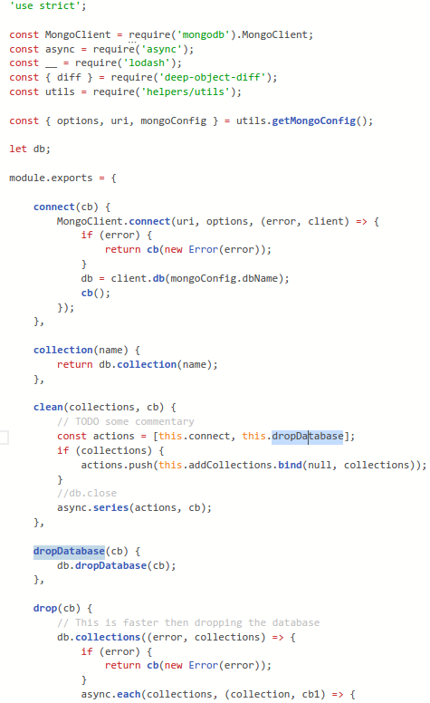
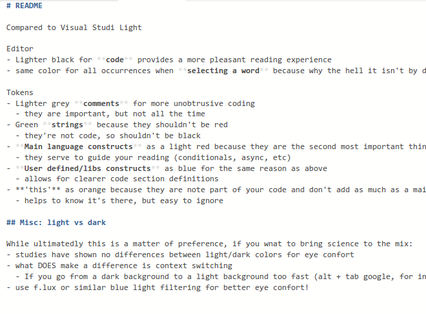
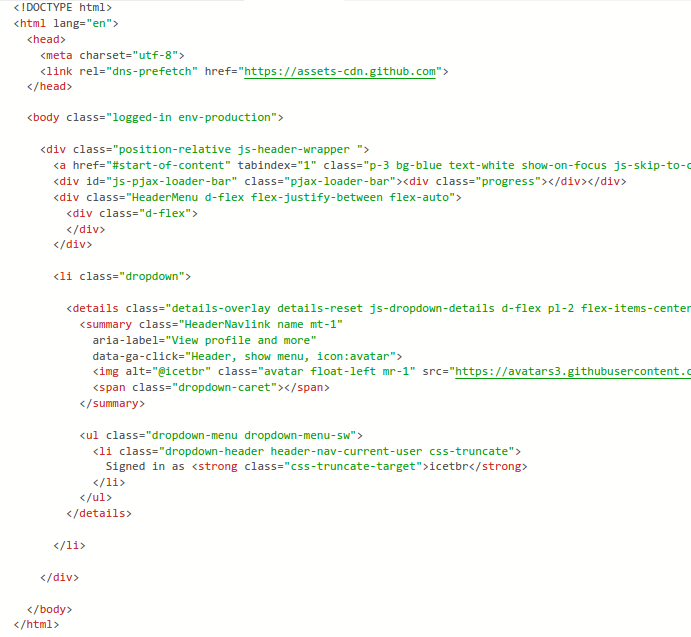

# [VSCode Minimalist Theme][1]
Based on Visual Studio Light with the following changes.


## Editor
- lighter black for **code** provides a more pleasant reading experience
- same color for all occurrences when **selecting a word** because why the hell it isn't by default?


## Tokens
- lighter gray **comments** for more unobtrusive coding
  - they are important, but not all the time
- green **strings**, because they shouldn't be red
  - they're not code, so shouldn't be black either
- **main language constructs** as a light red, because they are the second most important thing in your code (second to the code itself)
  - they serve to guide your reading (conditionals, async, etc)
- **user defined/libs constructs** as blue for the same reason as above
  - allows for clearer code section definitions
- `this` as orange because they are note part of your code and don't add as much as a main language construct
  - helps to know it's there, but easy to ignore


## Markdown
- lighter syntax decoration, like the `**`from bold, **nearly** hiding them
- decorate bold and italic as such
- distinctive and pleasant heading colors: H2 red, H3 blue, H4 orange
  - these suit me because of my colorful `.mds` with many code blocks, but I'm still thinking about them


## Screenshots

### Javascript


### Markdown


### HTML



## Light vs Dark
- studies have shown **no differences** between light/dark colors for eye comfort
- what DOES make a difference is **context switching**
  - If you go from a dark background to a light background too fast (`alt + tab Google`, for instance), your **pupils** will have to **dilate** to adapt to the new background, making your eyes tired faster
- use `f.lux` or similar blue light filtering software
- work in a well lit environment, based on my experience I would rate:
  - 10 natural light from windows
  - 8 overhead light
  - 5 ScreenBar (don't buy Baseus, go for Xiaomi or Benq)
  - 4 strong bias light (I never had a good one)
  - 3 desk light
  - 0 no light, monitor only
- use white light (~6000k) by day and warm light (~3000) by night
- https://www.wired.co.uk/article/dark-mode-chrome-android-ios-science
- https://www.androidauthority.com/dark-mode-1046425/


## How to customize it
The following can be applied to `settings.json`.

If your inline code blocks have a frame, it's because of an extension. Use this to disable:

```json
"markdown.extension.syntax.decorations": false,
```

If you dislike any of the changes, you can override them. See the [source](themes/Minimalist-color-theme.json) code for scope rules, or type `CTRL + ALT + SHIFT + I` to toggle inspect mode, and that will give you the `scope` name you need to customize.

To revert the H2 heading color for instance:

```json
"editor.tokenColorCustomizations": {
    "[Minimalist]": {
        "textMateRules": [
          {
            "name": "Markdown h2 heading",
            "scope": "heading.2.markdown punctuation.definition.heading.markdown, heading.2.markdown entity.name.section.markdown, heading.2.markdown string.other.link.title.markdown",
            "settings": {
              "foreground": "#365f91",
            }
          },
        ]
    }
}
```

<!-- explain overhead light position -->

[1]: https://marketplace.visualstudio.com/items?itemName=icetbr.vscode-theme-minimalist
